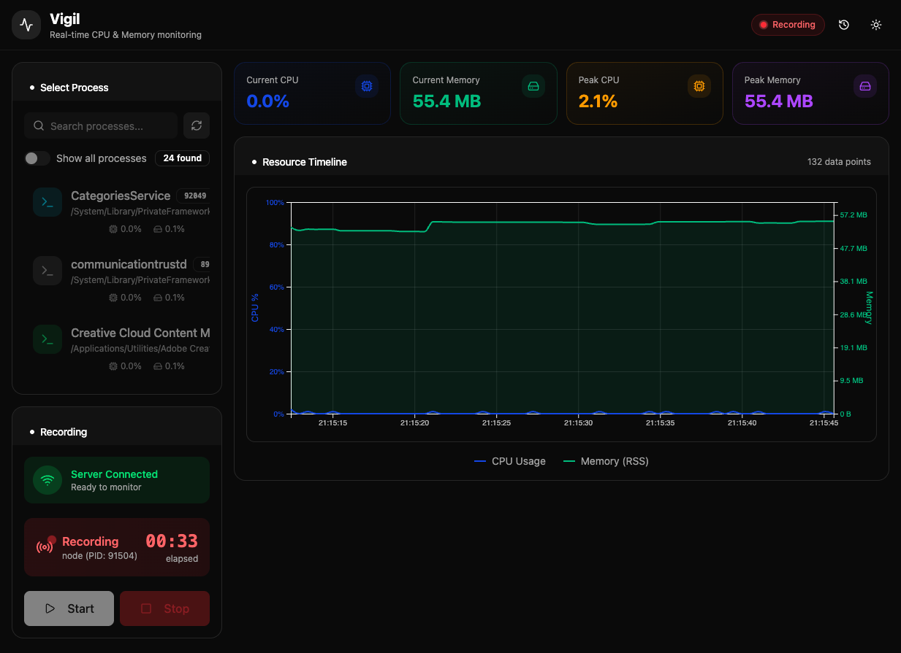

# Vigil

Real-time process monitoring with CPU & memory tracking.




## Features

- **Real-time Monitoring** - Track CPU and memory usage of any running process
- **Session Recording** - Record monitoring sessions and review them later
- **Interactive Timeline** - Visualize resource usage over time with D3.js charts
- **Session History** - Browse and manage past monitoring sessions
- **Live Stats** - View current and peak CPU/memory with trend indicators

## Tech Stack

**Frontend:**
- React 19 with TypeScript
- Vite for fast development
- Tailwind CSS for styling
- D3.js for data visualization
- Radix UI components

**Backend:**
- Node.js with Express
- WebSocket for real-time updates
- SQLite for session storage

## Getting Started

### Prerequisites

- Node.js 18+
- npm or yarn

### Installation

1. Clone the repository:
```bash
git clone https://github.com/shivsarthak/vigil.git
cd vigil
```

2. Install dependencies:
```bash
npm install
```

3. Start the development server:
```bash
npm run dev
```

The client will be available at `http://localhost:5173` and the server at `http://localhost:3001`

## Usage

1. Select a process from the list
2. Click "Start Recording" to begin monitoring
3. Watch real-time CPU and memory usage in the timeline
4. Stop recording to save the session
5. Review past sessions from the history panel

## Project Structure

```
vigil/
├── packages/
│   ├── client/              # React frontend (@vigil/client)
│   │   └── src/
│   │       ├── components/  # UI components
│   │       ├── hooks/       # Custom React hooks
│   │       ├── context/     # React context providers
│   │       ├── pages/       # Page components
│   │       ├── lib/         # Utilities
│   │       └── types/       # TypeScript types
│   ├── server/              # Express backend (@vigil/server)
│   │   └── src/
│   │       ├── server.ts        # Main server & WebSocket
│   │       ├── monitor.ts       # Process monitoring
│   │       ├── processScanner.ts # Process discovery
│   │       └── sessionManager.ts # Session storage
│   └── data/                # SQLite database
└── package.json             # Root package with npm workspaces
```

## License

MIT
